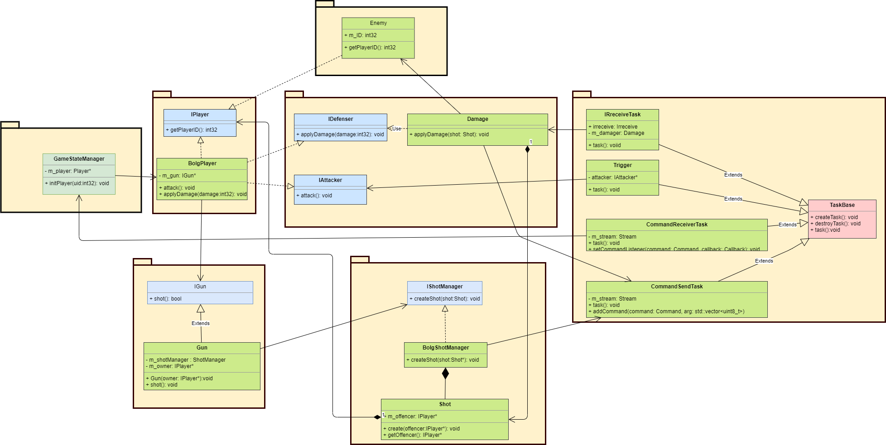

# Miconプログラム設計

## release-v1で実装すること

- Androidとの通信コマンド
- 赤外線受信、引き金監視タスク
- 発砲、被弾システム

## 将来的に拡張できるようにしておくこと

- 赤外線の送信データはカスタムできるようにする
- 通信コマンドを追加しやすいようにする
- 銃の機能は拡張しやすいようにする

## プログラムの流れ

1. 起動
2. AndroidからuserIDを受信しMicon側のuserIDを初期化
3. Androidからゲーム開始の通知を受信すると赤外線、引き金の監視を開始
4. 引き金を引くとuserIDを赤外線送信し、Bluetoothで発砲を通知 
赤外線を受信すると受信データからuserIDを判別しAndroidへ通知

## クラス図

